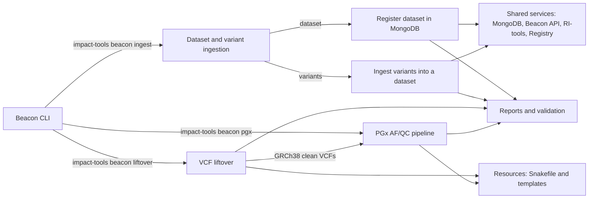
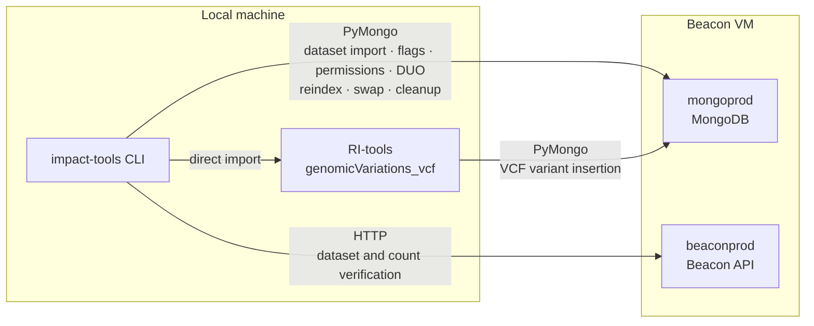

# Beacon tools

Documentation for Beacon preprocessing, ingestion and query workflows.


## Architecture overview




## Prerequisites

### Python dependencies

`pymongo` and `httpx` are required and declared in `pyproject.toml`. They are installed automatically with the package:

```bash
pip install -e .
```

### External tools

- **beacon2-ri-tools-v2** — installed as a Git dependency (see `pyproject.toml`). The `genomicVariations_vcf` module must be importable from the environment where impact-tools runs.
- **Docker / Podman** — required by `liftover` (CrossMap, bcftools) and by `pgx` (GLnexus, pgx_pilot) when running with the `local` executor.

Beacon ingestion talks to the deployment directly over PyMongo and the Beacon HTTP API. It does **not** open SSH connections, run remote `podman exec` commands, edit remote YAML files, or restart the API container.

### Environment variables

| Variable | Required | Description |
|---|---|---|
| `IMPACT_TOOLS_BEACON_MONGO_PASSWORD` | Yes (ingest) | MongoDB password. Takes precedence over `beacon.mongo.password` in the config file. |
| `IMPACT_TOOLS_BEACON_REGISTRY` | No | Override path for the local SQLite registry (default: `~/.impact_tools/beacon_registry.sqlite3`). |

### Configuration

Beacon configuration lives under the `beacon` key in `~/.impact_tools/extra_config.json` or `.yaml` (user-level override). Defaults are shipped in `impact_tools/conf/configuration.json`. The relevant sections are:

```json
{
  "beacon": {
    "execution": {
      "profile": "local"
    },
    "mongo": {
      "host": "<VM IP>",
      "port": 8085,
      "user": "root",
      "password": null,
      "auth_source": "admin",
      "database": "beacon",
      "direct": true,
      "tls": false,
      "tls_ca": null,
      "tls_cert": null,
      "tls_allow_invalid": false,
      "server_timeout_ms": 10000,
      "connect_timeout_ms": 10000,
      "socket_timeout_ms": 30000
    },
    "api": {
      "base_url": "http://<beacon-api-host>:<port>",
      "timeout_seconds": 30,
      "verify_tls": true
    },
    "pgx": {
      "ref_fasta": "/refs/GRCh38.fa",
      "output_dir": "/results/pgx",
      "pgx_image": "/images/pgx_pilot_v1.sif",
      "glnexus_image": "/images/glnexus_v1.4.1.sif",
      "executor": "hpc",
      "glnexus_config": "gatk",
      "snakemake_jobs": 8,
      "pypgx_snakefile": null,
      "slurm": {
        "time_limit": "48:00:00",
        "memory": "64G",
        "cpus": 16,
        "extra_args": []
      }
    }
  }
}
```

The MongoDB password must **not** be stored in the config file. Set it through the environment variable instead:

```bash
export IMPACT_TOOLS_BEACON_MONGO_PASSWORD=<password>
```


## Connectivity model

`impact-tools` uses two independent channels to communicate with the Beacon deployment:

| Channel | Protocol | Used for |
|---|---|---|
| **PyMongo** | TCP to MongoDB port | Dataset import, flags, permissions and DUO terms; variant staging/swap, reindex and old-backup cleanup |
| **Beacon HTTP API** | HTTP/HTTPS | Post-ingest verification (dataset visibility, variant count) |



### What uses PyMongo directly

All data operations talk to MongoDB directly:

- Importing `datasets.json` into the `datasets` collection (`mongo_import_datasets`)
- Storing dataset flags `isTest`/`isSynthetic` in `datasetsConf` (`mongo_set_dataset_flags`)
- Storing dataset access permissions in `datasetsPermissions` (`mongo_set_dataset_permissions`)
- Upserting dataset-scoped DUO terms into `filtering_terms` (`mongo_upsert_duo_filtering_terms`)
- Counting and verifying dataset documents (`mongo_count_dataset`, `mongo_list_datasets`)
- Running `genomicVariations_vcf` locally with the MongoDB URI injected via `DATABASE_URI` environment variable (`run_genomic_variations_vcf`)
- Counting, renaming and deleting variant documents across staging, active and backup dataset IDs
- Rebuilding MongoDB indexes and auxiliary collections (`mongo_reindex`) — mirrors `beacon.connections.mongo.reindex` but runs locally without container exec

### What uses the Beacon HTTP API

The API is used for read-only verification only:

- Confirming dataset visibility via `GET /api/datasets`
- Confirming variant count via `GET /api/g_variants?datasets=<id>&requestedGranularity=count`

The generic Beacon filtering-terms extractor is **not** run by impact-tools. Only the dataset-scoped DUO terms produced by `ingest dataset` are written to `filtering_terms`.


## Common options

| Option | Available on | Description |
|---|---|---|
| `-o/--output-dir` | all beacon subcommands | Directory for logs and metrics. Defaults to `<base-dir>/logs/` (or `./logs/` for commands without `--base-dir`). |
| `--no-report` | all beacon subcommands | Skip HTML report generation. The metrics JSON is always written regardless. |
| `--run-profile` | `liftover`, `ingest` | Execution environment label (`local`, `ws`, `hpc`) recorded in metrics. Does not affect execution. Can also be set via `beacon.execution.profile` in the config file. On `ingest` it is set on the group: `impact-tools beacon ingest --run-profile ws variants ...`. |


## Dataset ingestion

Registers a new dataset in the Beacon deployment using direct MongoDB and Beacon API access. Must be run before variant ingestion.

```bash
impact-tools beacon ingest dataset \
  --dataset-id MY_DATASET \
  --name "My dataset" \
  --description "Description" \
  --ref-genome GRCh38 \
  --granularity record \
  --is-test n \
  --set-permissions public \
  --duo-code DUO:0000042 \
  --base-dir /path/to/beacon/workdir
```

`--dataset-id`, `--name`, `--description`, `--ref-genome` and the test/synthetic flags are prompted interactively if omitted.

### What it does (step by step)

1. **Validates** `dataset_id` format, reference genome, granularity and any `--duo-code` values.
2. **Creates the local directory tree** under `<base-dir>`:
   ```
   config/<dataset_id>/datasets.csv
   config/<dataset_id>/datasets.json   ← generated by csv_to_bff
   work/<dataset_id>/
   inputs/<dataset_id>/
   ```
3. **Generates `datasets.json`** by replicating the `csv_to_bff.py` hashing logic from beacon2-ri-tools-v2 (`_id = sha256(dataset_id + id)`). When `--duo-code` is given, `dataUseConditions.duoDataUse` is injected into the document.
4. **Imports `datasets.json` into `db.datasets`** via PyMongo (`$setOnInsert` upsert — existing documents are never overwritten).
5. **Verifies** that the document is present in the `datasets` collection.
6. **Stores dataset flags** `isTest`/`isSynthetic` in `db.datasetsConf`.
7. **Stores dataset permissions** (access level and granularity) in `db.datasetsPermissions`.
8. **Upserts dataset-scoped DUO terms** into `db.filtering_terms` when `--duo-code` is provided.
9. **Verifies dataset visibility** via `GET /api/datasets`.
10. **Records the registration** in the local SQLite registry.
11. **Writes a JSON metrics file** under `<base-dir>/logs/` (or `<output-dir>/logs/`). HTML report also written unless `--no-report` is set.

No SSH access, remote `podman exec`, remote YAML edits or API container restart are involved.

### Key options

| Option | Description |
|---|---|
| `--dataset-id` | Beacon dataset identifier. Prompted if omitted. |
| `--name` | Dataset display name. Prompted if omitted. |
| `--description` | Dataset description. Prompted if omitted. |
| `--ref-genome` | `GRCh37` or `GRCh38`. Prompted if omitted (default `GRCh38`). |
| `--granularity` | `boolean`, `count` or `record` (default: `record`). |
| `--set-permissions` | Initial dataset permissions level: `public`, `registered` or `controlled` (default: `public`). |
| `--set-email` | Controlled-user e-mail. Only used with `--set-permissions controlled`. |
| `--is-test` | Mark the dataset as a test dataset: `y`/`n` (default: `n`). Stored in `db.datasetsConf`. |
| `--is-synthetic` | Flag marking the dataset as synthetic. Stored in `db.datasetsConf`. |
| `--duo-code` | Data Use Ontology code (e.g. `DUO:0000042`). Repeatable. Labels are resolved automatically. |
| `--base-dir` | Working directory where config files and logs are written (default: current directory). |
| `--dry-run` | Validate inputs and build the execution plan without writing files, metrics, reports or MongoDB records. |

### Dry run

```bash
impact-tools beacon ingest dataset --dataset-id MY_DATASET --dry-run
```

Validates inputs and builds the execution plan without touching the filesystem, MongoDB or the API. No files, metrics, reports or MongoDB records are written.

### Artifacts

```
<base-dir>/
  config/
    <dataset_id>/
      datasets.csv        ← input to csv_to_bff
      datasets.json       ← imported into db.datasets
  work/<dataset_id>/
  inputs/<dataset_id>/
  logs/                   ← or <output-dir>/logs/
    beacon_ingest_dataset_<id>_<timestamp>.metrics.json
    beacon_ingest_dataset_<id>_<timestamp>.report.html  ← unless --no-report
```


## Variant ingestion

Ingests genomic variants from one or more VCF files into an existing dataset using a safe stage→verify→swap workflow, over direct MongoDB and Beacon API access.

```bash
# Single VCF
impact-tools beacon ingest \
  --run-profile ws \
  variants \
  --dataset-id MY_DATASET \
  --vcf path/to/variants.vcf.gz \
  --ref-genome GRCh38

# Directory of VCFs (all .vcf and .vcf.gz files are processed together)
impact-tools beacon ingest \
  --run-profile ws \
  variants \
  --dataset-id MY_DATASET \
  --vcf-dir path/to/vcf_dir/ \
  --ref-genome GRCh38
```

`--vcf` and `--vcf-dir` are mutually exclusive. The dataset must already be registered (`ingest dataset` must have run first); an unknown dataset ID stops the command before running RI-tools.

### Stage → verify → swap workflow (step by step)

1. **Resolve VCF inputs** — validates file existence and extension (`.vcf` / `.vcf.gz`). Counts variants in each file (lines not starting with `#`). Directory inputs are selected in deterministic filename order.
2. **Generate run IDs**:
   - `staging_id = <dataset_id>_staging_<YYYYMMDD_HHMMSS>`
   - `old_id     = <dataset_id>_old_<YYYYMMDD_HHMMSS>`
3. **Validate dataset registration** — queries MongoDB to confirm `dataset_id` exists in the `datasets` collection. Fails with a list of available datasets if not found.
4. **Run RI-tools locally** (`genomicVariations_vcf`) for each VCF against `staging_id`. The MongoDB URI is injected via `DATABASE_URI`. Variants land in a staging collection, not the live one.
5. **Dry-run exit point** — if `--dry-run`, delete the staging variants just created and stop (see below).
6. **Count staging variants** via PyMongo and verify the count matches the sum of RI-tools-reported insertions.
7. **Atomic dataset ID swap** via PyMongo `update_many`:
   - Renames `<dataset_id>` → `old_id` (backs up the currently active variants)
   - Renames `staging_id` → `<dataset_id>` (promotes staging to active)
8. **Reindex** via PyMongo — rebuilds all MongoDB indexes on `genomicVariations` and `caseLevelData`, and ensures auxiliary collections (`counts`, `synonyms`, `targets`, `caseLevelData`, `similarities`) exist.
9. **API verification** — `GET /api/datasets` to confirm visibility and `GET /api/g_variants?datasets=<id>&requestedGranularity=count` to confirm the variant count matches.
10. **Old backup cleanup** (optional) — if `--cleanup-old` is passed, deletes `old_id` variants from MongoDB immediately. Otherwise, offers an interactive prompt after the ingest to delete backups older than 7 days.
11. **Writes a JSON manifest** under `./logs/` (or `<output-dir>/logs/`). HTML report also written unless `--no-report` is set.

No SSH, container commands, filtering-terms extraction or API restart are involved.

### Key options

| Option | Description |
|---|---|
| `--dataset-id` | Target dataset (required, must already exist in MongoDB). |
| `--vcf` | Single `.vcf` or `.vcf.gz` file to ingest. |
| `--vcf-dir` | Directory containing `.vcf` / `.vcf.gz` files. All files are ingested together into the same dataset. |
| `--ref-genome` | `GRCh37` or `GRCh38` (default: `GRCh38`). |
| `--dry-run` | Run RI-tools against the staging dataset and stop before the swap. |
| `--cleanup-old` | Delete the `_old_` backup immediately after a successful swap. Off by default to allow rollback. |

### Dry run

```bash
impact-tools beacon ingest \
  --run-profile ws \
  variants \
  --dataset-id MY_DATASET \
  --vcf-dir path/to/vcf_dir/ \
  --ref-genome GRCh38 \
  --dry-run
```

A variant-ingestion dry run still runs RI-tools against the temporary staging dataset ID. It then **deletes the staging variants it just created** and stops before validating and promoting them to the active dataset. This mode is intended to validate RI-tools processing (and its own cleanup) without changing the active dataset.

### Old variant backups

Every successful swap creates a `<dataset_id>_old_<run_id>` backup in MongoDB. These accumulate over time. impact-tools offers an interactive cleanup prompt at the end of each non-dry-run ingestion:

```
Old variant backups found for MY_DATASET:

[1] MY_DATASET_old_20260601_120000
    age: 21 days
    variants: 18863
    default action: delete

Delete backups older than 7 days? [Y/n]:
```

Backups are skipped (not prompted) when stdin is not a TTY (e.g. CI pipelines).

### Variant counting note

When multiple input VCFs contain the same genomic variant, the raw sum of VCF records can be greater than the number inserted into MongoDB. MongoDB and API validation therefore use the accumulated RI-tools inserted count, not the raw VCF line count.

### Artifacts

```
./logs/                   ← or <output-dir>/logs/
  beacon_ingest_variants_manifest_<staging_id>.json
  beacon_ingest_variants_report_<staging_id>.html   ← unless --no-report
```


## Liftover

Converts GRCh37 VCF files to GRCh38 using CrossMap via Docker/Podman. Input VCFs must be placed under `<base-dir>/inputs/`.

```bash
impact-tools beacon liftover --base-dir /path/to/beacon/workdir
```

The command first checks genome builds of all input VCFs. If all are already GRCh38, liftover is skipped. Otherwise it runs CrossMap and produces clean, normalised output VCFs in `<base-dir>/liftover/`.

### Key options

| Option | Description |
|---|---|
| `--base-dir` | Working directory. Input VCFs are read from `<base-dir>/inputs/`, output written to `<base-dir>/liftover/` (default: current directory). |
| `--chain` | Chain file for liftover (default: `<base-dir>/liftover/resources/hg19ToHg38.over.chain.gz`). |
| `--fasta` | Reference FASTA for GRCh38 (default: `<base-dir>/liftover/resources/GRCh38_full_analysis_set_plus_decoy_hla.fa`). |
| `--bcftools-image` | Docker image for bcftools (default: `docker.io/staphb/bcftools:1.21`). |
| `--crossmap-image` | Docker image for CrossMap. |
| `-w/--workers` | Parallel worker threads (default: 4). |
| `--check` | Only check inputs and detect genome builds; do not run liftover. |
| `--cleanup` | Remove intermediate files after the pipeline completes. |
| `--force` | Skip interactive confirmation prompts. |

### Artifacts

```
<base-dir>/
  liftover/
    <sample_id>.GRCh38.clean.vcf.gz
    <sample_id>.GRCh38.clean.vcf.gz.tbi
    <sample_id>_liftover.log
  logs/                   ← or <output-dir>/logs/
    beacon_liftover_<timestamp>.metrics.json
    beacon_liftover_<timestamp>.report.html   ← unless --no-report
```


## PGx

Runs the pgx_pilot AF/QC pipeline over a cohort of DRAGEN gVCF files. It performs joint genotyping with GLnexus, validates the resulting multi-sample VCF, and executes the Snakemake AF/QC (and optional PyPGx) workflows inside a container.

With `--executor local` the pipeline runs directly via Docker. With `--executor hpc` an `sbatch` script is generated for SLURM using Singularity; submit it manually (or with `--prepare` it is only written, not submitted).

```bash
# Prepare the workspace and launcher without running/submitting
impact-tools beacon pgx \
  --samples-tsv /data/IMPACT_BATCH_001.samples.tsv \
  --gvcf-dir /data/gvcfs/ \
  --executor hpc \
  --prepare

# Pass gVCF paths explicitly instead of a directory scan
impact-tools beacon pgx \
  --samples-tsv /data/IMPACT_BATCH_001.samples.tsv \
  --gvcf-list /data/batch001.list \
  --prepare
```

Exactly one gVCF source is required: `--gvcf-dir` (recursive scan for `*.hard-filtered.gvcf.gz`) or `--gvcf-list` (explicit `sample_id<TAB>path` file). `--release-id` is auto-derived from the TSV filename when omitted (e.g. `IMPACT_BATCH_001.samples.tsv` → `IMPACT_BATCH_001`).

`ref_fasta`, `output_dir` and `pgx_image` are required; each may be provided via its CLI flag or under the `beacon.pgx` config namespace. Remaining infrastructure (`glnexus_image`, `slurm` settings, ...) is read from config.

### Key options

| Option | Description |
|---|---|
| `--samples-tsv` | Tab-separated sample metadata: `sample_id`, `sex`, `country_code`[, `batch_id`[, `ancestry_group`]]. Required. |
| `--gvcf-dir` | Directory searched recursively for `*.hard-filtered.gvcf.gz` files (DRAGEN output). |
| `--gvcf-list` | File listing `sample_id<TAB>gvcf_path` entries (one per line). |
| `--release-id` | Release identifier. Auto-derived from the `--samples-tsv` filename if omitted. |
| `--executor` | `local` (Docker) or `hpc` (SLURM sbatch via Singularity). Defaults to `beacon.pgx.executor`, else `local`. |
| `--ref-fasta` | Reference genome FASTA. Required (or set `beacon.pgx.ref_fasta`). |
| `--pgx-image` | pgx_pilot container image: a `.sif` path for `--executor hpc`, or a Docker image reference for `--executor local`. Required (or set `beacon.pgx.pgx_image`). |
| `-o/--output-dir` | Root output directory (`pgx_runs/` is created inside). Defaults to `beacon.pgx.output_dir`, else current directory. |
| `--prepare` | Prepare the workspace and launcher script; do not execute or submit. |
| `--dry-run` | Validate inputs and print the plan without writing any files. |
| `--force` | Remove an existing workspace and start fresh. |
| `--pypgx` | Enable the optional PyPGx pharmacogenomics sub-workflow. |
| `--cleanup` | Remove the `results/temp` scratch intermediates after a successful run (prompts unless `--force`). |
| `--no-report` | Skip HTML report generation (metrics JSON always written). |

### What the generated script does

1. **GLnexus joint genotyping** — all gVCFs are merged into a single multi-sample VCF.
2. **Sample validation** — the VCF sample list is diffed against `expected_samples.txt`; the script aborts on mismatch.
3. **Snakemake AF/QC pipeline** — normalisation, masking, allele-frequency calculation and QC tagging, producing a sites-only PASS VCF ready for Beacon ingestion.
4. **PyPGx** (optional, `--pypgx`) — per-sample pharmacogenomic allele, genotype and phenotype calls.
5. **Cleanup** (optional, `--cleanup`) — removes the `results/temp` scratch intermediates. Runs only after the steps above succeed, so failures leave the temp files in place for debugging.

### Artifacts

```
<output-dir>/
  pgx_runs/<release_id>/
    config.yaml
    manifests/
      samples.tsv
      gvcfs.list
      glnexus_inputs.list
      expected_samples.txt
      batch.json
    slurm/pgx_<release_id>.sbatch        ← .sh for --executor local
    data/<release_id>.joint.vcf.gz       ← GLnexus multi-sample VCF
    results/<release_id>.sites.pass.vcf.gz   ← sites-only, PASS QC, with AF (Beacon-ready)
    results/<release_id>.sites.all.vcf.gz    ← sites-only, all variants
    results/intermediate/<release_id>.full_sample_data.vcf.gz
    results/pgx/                         ← PyPGx CSVs (when --pypgx is used)
    logs/                                ← SLURM stdout/stderr, metrics JSON and HTML report
```


## Local SQLite registry

Every dataset registration and variant ingestion is recorded in a local SQLite database at `~/.impact_tools/beacon_registry.sqlite3` (overridable via `IMPACT_TOOLS_BEACON_REGISTRY`).

| Table | Content |
|---|---|
| `dataset_registrations` | One row per dataset: ID, name, genome build, granularity, flags, `base_dir`, timestamp |
| `variant_ingestions` | One row per VCF (keyed by SHA-256): status (`RUNNING`/`OK`/`FAILED`), staging ID, old ID, variant count, timestamps |
| `processing_claims` | Advisory locks for concurrent execution (auto-expire after 12 hours) |