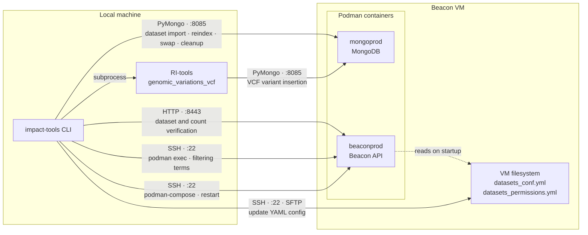

# Beacon tools

Documentation for Beacon preprocessing, ingestion, authentication and query workflows.


## Architecture overview


## Prerequisites

### Python dependencies

`pymongo` and `httpx` are required and declared in `pyproject.toml`. They are installed automatically with the package:

```bash
pip install -e .
```

### External tools

- **beacon2-ri-tools-v2** — installed as a Git dependency (see `pyproject.toml`). The `genomicVariations_vcf` module must be importable from the environment where impact-tools runs.
- **paramiko** — required for the SSH operations that still remain (filtering terms extraction and API restart).

### Environment variables

| Variable | Required | Description |
|---|---|---|
| `IMPACT_TOOLS_BEACON_MONGO_PASSWORD` | Yes | MongoDB password. Takes precedence over `beacon.mongo.password` in the config file. |
| `IMPACT_TOOLS_BEACON_REGISTRY` | No | Override path for the local SQLite registry (default: `~/.impact_tools/beacon_registry.sqlite3`). |

### Configuration

Beacon configuration lives under the `beacon` key in `impact_tools/conf/configuration.json` (or the user-level override at `~/.config/impact-tools/config.yaml`). The relevant sections are:

```json
{
  "beacon": {
    "remote": {
      "host": "<VM IP>",
      "user": "bioinfo",
      "port": 22,
      "identity_file": null,
      "beacon_dir": "/opt/beacon/beacon2-pi-api-isciii",
      "datasets_conf_dir": "/opt/beacon/beacon2-pi-api-isciii/beacon/conf/datasets",
      "datasets_permissions_dir": "/opt/beacon/beacon2-pi-api-isciii/beacon/permissions/datasets"
    },
    "containers": {
      "api": "beaconprod"
    },
    "mongo": {
      "host": "<VM IP>",
      "port": 8085,
      "user": "root",
      "password": null,
      "auth_source": "admin",
      "database": "beacon",
      "direct": true,
      "tls": false
    },
    "api": {
      "base_url": "http://<beacon-api-host>:<port>",
      "timeout_seconds": 30,
      "verify_tls": true
    }
  }
}
```

The MongoDB password must **not** be stored in the config file. Set it through the environment variable instead:

```bash
export IMPACT_TOOLS_BEACON_MONGO_PASSWORD=<password>
```


## Connectivity model

`impact-tools` uses three independent channels to communicate with the Beacon deployment:

| Channel | Protocol | Used for |
|---|---|---|
| **PyMongo** | TCP to MongoDB port | Dataset import, variant staging/swap, reindex, old backup cleanup |
| **Beacon HTTP API** | HTTP/HTTPS | Post-ingest verification (dataset visibility, variant count) |
| **SSH** | paramiko | YAML config file updates, filtering terms extraction (`podman exec`), API restart |



### What uses PyMongo directly

All data operations bypass SSH and talk to MongoDB directly:

- Importing `datasets.json` into the `datasets` collection (`mongo_import_datasets`)
- Counting and verifying dataset documents (`mongo_count_dataset`)
- Running `genomicVariations_vcf` locally with the MongoDB URI injected via `DATABASE_URI` environment variable (`run_genomic_variations_vcf`)
- Counting, renaming and deleting variant documents across staging, active and backup dataset IDs
- Rebuilding MongoDB indexes and auxiliary collections (`mongo_reindex`) — mirrors `beacon.connections.mongo.reindex` but runs locally without container exec

### What still uses SSH

Three operations require SSH because they depend on the VM filesystem or container runtime:

1. **YAML config file updates** — `datasets_conf.yml` and `datasets_permissions.yml` live on the VM filesystem. impact-tools reads the current file over SFTP, merges the new dataset block, writes a timestamped backup, and writes the updated file back.
2. **Filtering terms extraction** — runs `podman exec beaconprod python -m beacon.connections.mongo.extract_filtering_terms` inside the Beacon API container. This step is **non-fatal**: if it fails the workflow logs a warning and continues to the API restart.
3. **API restart** — runs `podman-compose restart beaconprod` in the beacon deployment directory on the VM so the API reloads updated YAML configuration.


## Common options

These options are available on all beacon subcommands:

| Option | Description |
|---|---|
| `-o/--output-dir` | Directory for logs and metrics. Defaults to `<base-dir>/logs/` (or `./logs/` for commands without `--base-dir`). |
| `--no-report` | Skip HTML report generation. The metrics JSON is always written regardless. |
| `--run-profile` | Execution environment label (`local`, `ws`, `hpc`) recorded in metrics. Does not affect execution. Can also be set via `beacon.execution.profile` in the config file. |


## Dataset ingestion

Registers a new dataset in the Beacon deployment. Must be run before variant ingestion.

```bash
impact-tools beacon ingest dataset \
  --dataset-id MY_DATASET \
  --name "My dataset" \
  --description "Description" \
  --ref-genome GRCh38 \
  --granularity record \
  --base-dir /path/to/beacon/workdir
```

All parameters are interactive if omitted.

### What it does (step by step)

1. **Validates** `dataset_id` format, reference genome and granularity.
2. **Creates the local directory tree** under `<base-dir>`:
   ```
   config/<dataset_id>/datasets.csv
   config/<dataset_id>/datasets.json   ← generated by csv_to_bff
   config/datasets_conf.yml            ← candidate YAML block
   config/datasets_permissions.yml     ← candidate YAML block
   work/<dataset_id>/
   inputs/<dataset_id>/
   ```
3. **Generates `datasets.json`** by replicating the `csv_to_bff.py` hashing logic from beacon2-ri-tools-v2 (`_id = sha256(dataset_id + id)`).
4. **Imports `datasets.json` into MongoDB** via PyMongo (`$setOnInsert` upsert — existing documents are never overwritten).
5. **Verifies** that the document is present in the `datasets` collection.
6. **Updates the YAML files on the VM** via SSH/SFTP — writes a backup before modifying.
7. **Restarts the Beacon API** via SSH so it reloads the updated YAML.
8. **Verifies dataset visibility** via `GET /api/datasets`.
9. **Records the registration** in the local SQLite registry.
10. **Writes a JSON metrics file** under `<base-dir>/logs/` (or `<output-dir>/logs/`). HTML report also written unless `--no-report` is set.

### Key options

| Option | Description |
|---|---|
| `--dataset-id` | Beacon dataset identifier. Prompted if omitted. |
| `--name` | Dataset display name. Prompted if omitted. |
| `--description` | Dataset description. Prompted if omitted. |
| `--ref-genome` | `GRCh37` or `GRCh38`. Prompted if omitted. |
| `--granularity` | `boolean`, `count` or `record` (default: `record`). |
| `--base-dir` | Working directory where config files and logs are written (default: current directory). |
| `--dry-run` | Generate local artifacts without touching MongoDB, the VM or the API. |

### Dry run

```bash
impact-tools beacon ingest dataset --dataset-id MY_DATASET --dry-run
```

Generates local artifacts (directories, CSV, JSON, YAML blocks) without touching MongoDB, the VM or the API.

### Artifacts

```
<base-dir>/
  config/
    <dataset_id>/
      datasets.csv        ← input to csv_to_bff
      datasets.json       ← imported into MongoDB
    datasets_conf.yml     ← YAML block applied to VM
    datasets_permissions.yml
  work/<dataset_id>/
  inputs/<dataset_id>/
  logs/                   ← or <output-dir>/logs/
    beacon_ingest_dataset_<id>_<timestamp>.metrics.json
    beacon_ingest_dataset_<id>_<timestamp>.report.html  ← unless --no-report
```


## Variant ingestion

Ingests genomic variants from one or more VCF files into an existing dataset using a safe stage→verify→swap workflow.

```bash
# Single VCF
impact-tools beacon ingest variants \
  --dataset-id MY_DATASET \
  --vcf path/to/variants.vcf.gz \
  --ref-genome GRCh38

# Directory of VCFs (all .vcf and .vcf.gz files are processed together)
impact-tools beacon ingest variants \
  --dataset-id MY_DATASET \
  --vcf-dir path/to/vcf_dir/ \
  --ref-genome GRCh38
```

`--vcf` and `--vcf-dir` are mutually exclusive. The dataset must already be registered (`ingest dataset` must have run first).

### Stage → verify → swap workflow (step by step)

1. **Resolve VCF inputs** — validates file existence and extension (`.vcf` / `.vcf.gz`). Counts variants in each file (lines not starting with `#`).
2. **Generate run IDs**:
   - `staging_id = <dataset_id>_staging_<YYYYMMDD_HHMMSS>`
   - `old_id     = <dataset_id>_old_<YYYYMMDD_HHMMSS>`
3. **Validate dataset registration** — queries MongoDB to confirm `dataset_id` exists in the `datasets` collection. Fails with a list of available datasets if not found.
4. **Run RI-tools locally** (`genomicVariations_vcf`) for each VCF against `staging_id`. The MongoDB URI is injected via `DATABASE_URI`. Variants land in a staging collection, not the live one.
5. **Dry-run exit point** — if `--dry-run`, stop here and write artifacts for inspection.
6. **Count staging variants** via PyMongo and verify the count matches the sum of RI-tools-reported insertions.
7. **Atomic dataset ID swap** via PyMongo `update_many`:
   - Renames `<dataset_id>` → `old_id` (backs up the currently active variants)
   - Renames `staging_id` → `<dataset_id>` (promotes staging to active)
8. **Reindex** via PyMongo — rebuilds all MongoDB indexes on `genomicVariations` and `caseLevelData`, and ensures auxiliary collections (`counts`, `synonyms`, `targets`, `similarities`) exist.
9. **Filtering terms extraction** via SSH (`podman exec beaconprod python -m beacon.connections.mongo.extract_filtering_terms`). Non-fatal: failure logs a warning and continues.
10. **API restart** via SSH (`podman-compose restart beaconprod`). Waits 15 seconds for the service to come back.
11. **API verification** — `GET /api/datasets` to confirm visibility and `GET /api/g_variants?datasets=<id>&requestedGranularity=count` to confirm the variant count matches.
12. **Old backup cleanup** (optional) — if `--cleanup-old` is passed, deletes `old_id` variants from MongoDB immediately. Otherwise, offers an interactive prompt after the ingest to delete backups older than 7 days.
13. **Writes a JSON manifest** under `./logs/` (or `<output-dir>/logs/`). HTML report also written unless `--no-report` is set.

### Key options

| Option | Description |
|---|---|
| `--vcf` | Single `.vcf` or `.vcf.gz` file to ingest. |
| `--vcf-dir` | Directory containing `.vcf` / `.vcf.gz` files. All files are ingested together into the same dataset. |
| `--ref-genome` | `GRCh37` or `GRCh38` (default: `GRCh38`). |
| `--dry-run` | Run RI-tools against the staging dataset and stop before the swap. Useful for validating VCF ingestion without affecting the live deployment. |
| `--cleanup-old` | Delete the `_old_` backup immediately after a successful swap. Off by default to allow rollback. |
| `--skip-filtering-terms` | Skip filtering terms extraction. Useful when ingesting multiple datasets in batch — run it once manually at the end. |

### Old variant backups

Every successful swap creates a `<dataset_id>_old_<run_id>` backup in MongoDB. These accumulate over time. impact-tools offers an interactive cleanup prompt at the end of each non-dry-run ingestion:

```
Old variant backups found for MY_DATASET:

[1] MY_DATASET_old_20260601_120000
    age: 21 days
    variants: 18863
    default action: delete

Delete backups older than 7 days? [Y/n]:
```

Backups are skipped (not prompted) when stdin is not a TTY (e.g. CI pipelines).

### Artifacts

```
./logs/                   ← or <output-dir>/logs/
  beacon_ingest_variants_manifest_<staging_id>.json
  beacon_ingest_variants_report_<staging_id>.html   ← unless --no-report
```


## Liftover

Converts GRCh37 VCF files to GRCh38 using CrossMap via Docker/Podman. Input VCFs must be placed under `<base-dir>/inputs/`.

```bash
impact-tools beacon liftover --base-dir /path/to/beacon/workdir
```

The command first checks genome builds of all input VCFs. If all are already GRCh38, liftover is skipped. Otherwise it runs CrossMap and produces clean, normalised output VCFs in `<base-dir>/liftover/`.

### Key options

| Option | Description |
|---|---|
| `--base-dir` | Working directory. Input VCFs are read from `<base-dir>/inputs/`, output written to `<base-dir>/liftover/` (default: current directory). |
| `--chain` | Chain file for liftover (default: `<base-dir>/liftover/resources/hg19ToHg38.over.chain.gz`). |
| `--fasta` | Reference FASTA for GRCh38 (default: `<base-dir>/liftover/resources/GRCh38_full_analysis_set_plus_decoy_hla.fa`). |
| `--bcftools-image` | Docker image for bcftools (default: `docker.io/staphb/bcftools:1.21`). |
| `--crossmap-image` | Docker image for CrossMap. |
| `-w/--workers` | Parallel worker threads (default: 4). |
| `--check` | Only check inputs and detect genome builds; do not run liftover. |
| `--cleanup` | Remove intermediate files after the pipeline completes. |
| `--force` | Skip interactive confirmation prompts. |

### Artifacts

```
<base-dir>/
  liftover/
    <sample_id>.GRCh38.clean.vcf.gz
    <sample_id>.GRCh38.clean.vcf.gz.tbi
  logs/                   ← or <output-dir>/logs/
    beacon_liftover_<timestamp>.metrics.json
    beacon_liftover_<timestamp>.report.html   ← unless --no-report
```


## PGx

Runs the pgx_pilot pharmacogenomics pipeline for each WGS sample. VCF inputs are resolved in priority order: `--vcf` (individual files, repeatable) > `--vcf-dir` (directory) > `<base-dir>/liftover/` (default).

```bash
# Using liftover output (default)
impact-tools beacon pgx --base-dir /path/to/beacon/workdir

# Using an explicit VCF directory
impact-tools beacon pgx \
  --base-dir /path/to/beacon/workdir \
  --vcf-dir /path/to/vcfs/

# Using individual files (repeatable)
impact-tools beacon pgx \
  --base-dir /path/to/beacon/workdir \
  --vcf /path/to/sample1.vcf.gz \
  --vcf /path/to/sample2.vcf.gz
```

Sex is inferred from non-reference chrY variant counts via bcftools. Ambiguous samples (count between `--sex-ambiguous-min` and `--sex-ambiguous-max`) require interactive input unless the sample is already in `samples.tsv`.

### Key options

| Option | Description |
|---|---|
| `--base-dir` | Working directory for workspaces, samples.tsv and logs (default: current directory). |
| `--vcf` | Individual VCF file(s). May be repeated. | 
| `--vcf-dir` | Directory of VCF files. Takes priority over liftover/ discovery. |
| `--pgx-repo` | Path to the pgx_pilot repository. Also settable via `PGX_REPO` environment variable or `beacon.pgx.repo` config key. |
| `--pgx-image` | Docker image for pgx_pilot (default: `goe/pgx-pipeline:latest`). |
| `--bcftools-image` | Docker image for bcftools sex inference (default: `docker.io/staphb/bcftools:1.21`). |
| `--country-code` | ISO 3166-1 alpha-2 country code written into `samples.tsv` (default: `ES`). |
| `--sex-ambiguous-min` | Lower bound of ambiguous chrY variant count zone (default: 5000). |
| `--sex-ambiguous-max` | Upper bound of ambiguous chrY variant count zone (default: 7000). |
| `-w/--workers` | Parallel worker threads for sex inference, workspace prep and pgx runs (default: 4). |
| `--snakemake-jobs` | Parallel jobs passed to Snakemake `-j` (default: 8). |
| `--prepare` | Only prepare workspaces and `samples.tsv`; do not run pgx_pilot. |
| `--run` | Only run pgx_pilot; skip workspace preparation (workspaces must already exist). |
| `--force` | Skip interactive confirmation prompts. |

### Workflow

1. **Discover VCFs** from `--vcf` (individual files) if given, else `--vcf-dir`, else `<base-dir>/liftover/`.
2. **Read existing `samples.tsv`** — samples already present are not re-processed.
3. **Infer sex** from chrY variant count for new samples (via bcftools Docker container). Ambiguous samples prompt for manual input.
4. **Append new records** to `<base-dir>/inputs/samples.tsv`.
5. **Prepare one workspace per sample** under `<base-dir>/pgx_runs/<sample_id>/` — creates `config.yaml`, symlinks VCF and index, copies Snakefile.
6. **Seed the shared resources cache** at `<base-dir>/pgx_resources/` from `pgx_repo/resources/` (static files only, downloaded reference genome cached here across runs).
7. **Run pgx_pilot** for each sample via Docker — mounts workspace as `/pipeline`, resources cache as `/pipeline/resources` (writable so the reference genome can be downloaded once).
8. **Write metrics and report** under `<base-dir>/logs/` (or `<output-dir>/logs/`).

### Artifacts

```
<base-dir>/
  inputs/
    samples.tsv                         ← sample registry (sex, country, VCF basename)
  pgx_runs/
    <sample_id>/
      config.yaml
      data/<sample_id>.vcf.gz
      results/<sample_id>.sites.all.vcf.gz
      results/<sample_id>.sites.pass.vcf.gz
  pgx_resources/                        ← shared reference cache (Docker-writable)
  logs/                                 ← or <output-dir>/logs/
    beacon_pgx_<timestamp>.metrics.json
    beacon_pgx_<timestamp>.report.html  ← unless --no-report
    <sample_id>_pgx.log                 ← per-sample Snakemake stdout/stderr
```


## Local SQLite registry

Every dataset registration and variant ingestion is recorded in a local SQLite database at `~/.impact_tools/beacon_registry.sqlite3` (overridable via `IMPACT_TOOLS_BEACON_REGISTRY`).

| Table | Content |
|---|---|
| `dataset_registrations` | One row per dataset: ID, name, genome build, granularity, flags, `base_dir`, timestamp |
| `variant_ingestions` | One row per VCF (keyed by SHA-256): status (`RUNNING`/`OK`/`FAILED`), staging ID, old ID, variant count, timestamps |
| `processing_claims` | Advisory locks for concurrent execution (auto-expire after 12 hours) |
