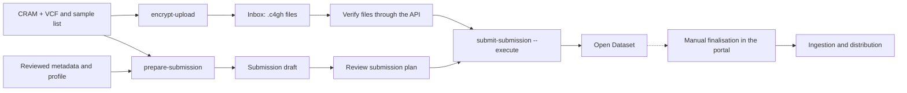

# EGA: from input files to submission

These guides take a CRAM + VCF batch from a workstation or HPC environment to
the Submitter Portal. They are not LocalEGA deployment instructions.

First, install the environment as described in the [Quick Start](../../README.md#quick-start).
Run `impact-tools ega --help` and `crypt4gh --help` **in that same environment**.
API submission also requires `httpx`, which is a package dependency; a
different Python environment may not have it installed.

1. [Encryption and Inbox upload](encryption-and-upload.md): sample selection,
   recipient public key, transfer, and per-file evidence.
2. [Submitter Portal submission](submitter-portal.md): metadata profile, draft,
   review, plan, execution, and resumption.

**Tool boundary:** `submit-submission` creates metadata objects and leaves the
Dataset open. It does not finalise the submission, release the Dataset, grant
download permissions, or verify ingestion into the Vault.

Names such as `SAMPLE_001`, `/data/...` paths, usernames, and endpoints in
these guides are illustrative. Replace them with approved values for your
environment. Never commit credentials, tokens, private keys, or sensitive
metadata to this repository.

| Use case | Tools |
| --- | --- |
| CRAM + VCF batch | `encrypt-upload` → `prepare-submission` → `submit-submission` |
| Separate encryption and upload | `encrypt` and `upload-inbox` |
| FASTQ test | Encrypt/upload, then prepare a separate metadata draft |

`prepare-submission` is specialised for CRAM + VCF; it does not infer metadata
from a FASTQ. For command options, run `impact-tools ega <command> --help`.
