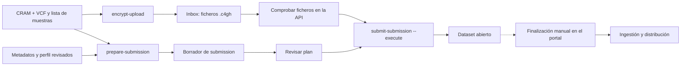

# EGA: de los ficheros a la submission

Estas guías explican el recorrido de un lote CRAM + VCF desde la estación de
trabajo o el HPC hasta el Submitter Portal. No son un manual de instalación de
LocalEGA.

Antes de empezar, instala el entorno según el [Quick Start](../../README.md#quick-start)
y comprueba `impact-tools ega --help` y `crypt4gh --help` **en ese mismo
entorno**. El envío a la API necesita también `httpx`, incluido entre las
dependencias del paquete; invocar otro Python puede dejarlo sin instalar.

1. [Cifrado y subida al Inbox](encryption-and-upload.md): selección de muestras,
   clave pública, transferencia y evidencias.
2. [Submission al Submitter Portal](submitter-portal.md): perfil de metadatos,
   borrador, revisión, plan, envío y reanudación.

**Límite de la herramienta:** `submit-submission` crea los metadatos y deja el
Dataset abierto. No finaliza la submission, no libera el Dataset, no concede
permisos de descarga ni verifica por sí solo la ingestión en el Vault.

Los nombres `SAMPLE_001`, las rutas `/data/...`, el usuario y los endpoints de
las guías son ilustrativos. Sustitúyelos por valores aprobados para tu entorno;
nunca copies credenciales, tokens, claves privadas o metadatos sensibles al
repositorio.

| Situación | Herramientas |
| --- | --- |
| Lote CRAM + VCF | `encrypt-upload` → `prepare-submission` → `submit-submission` |
| Cifrado y subida por separado | `encrypt` y `upload-inbox` |
| FASTQ de prueba | Cifrado/subida y borrador de metadatos preparado aparte |

`prepare-submission` está especializado en CRAM + VCF; no infiere metadatos de
un FASTQ. Para las opciones disponibles, ejecuta
`impact-tools ega <comando> --help`.
